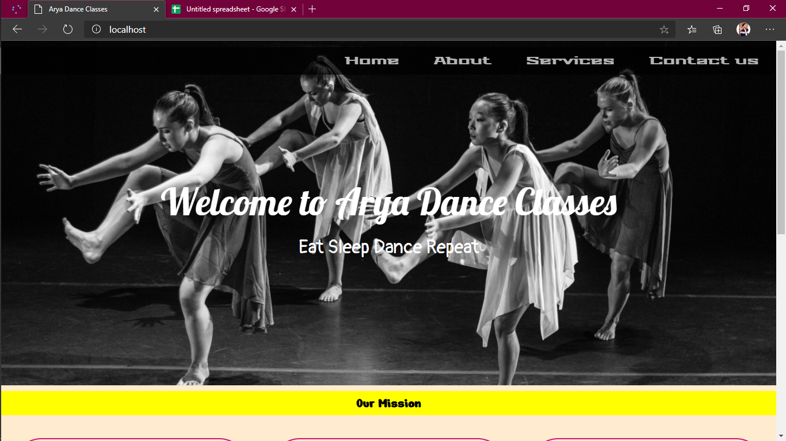
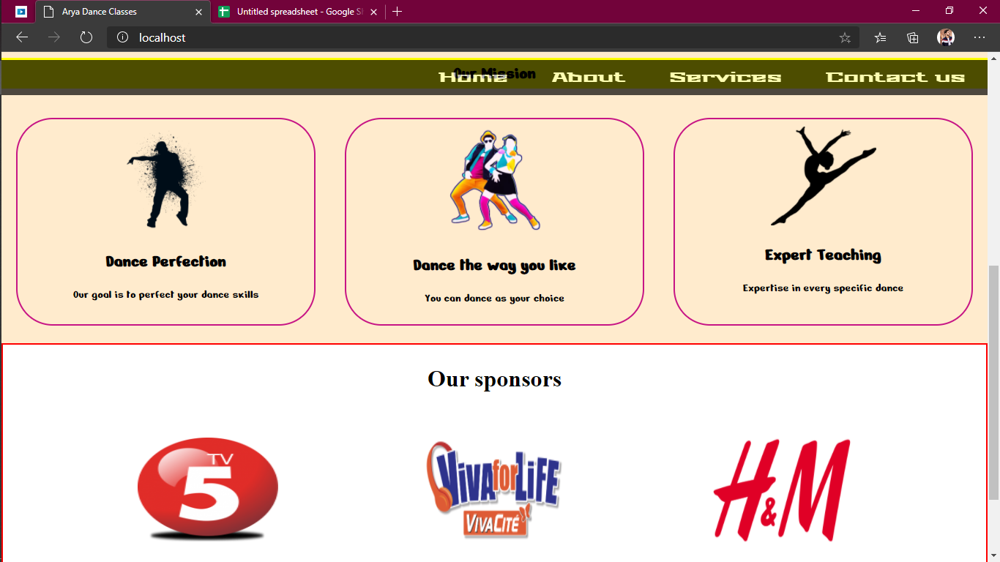
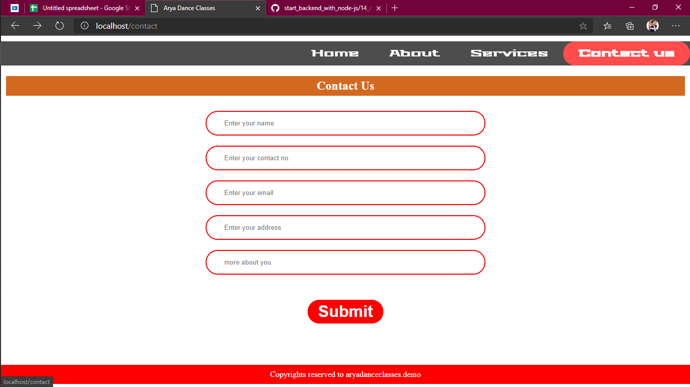

<h1>A demo Dance Academy Website with contact form</h1>
<h2>Tech Stack Used</h2>

### MongoDB, Node js, Express and Pug template engine
<ul>
<li>Pug template engine for views</li>
<li>Pure CSS for styling</li>
<li>Vanilla Javascript for front-end interaction</li>
<li>Node.js (JavaScript for backend) used in backend</li>
<li>Express Framework in backend</li>
<li>MongoDB as a database</li>
</ul> 

### Check this project
--> Download the folder
<pre>git clone </pre>

  
  

  
