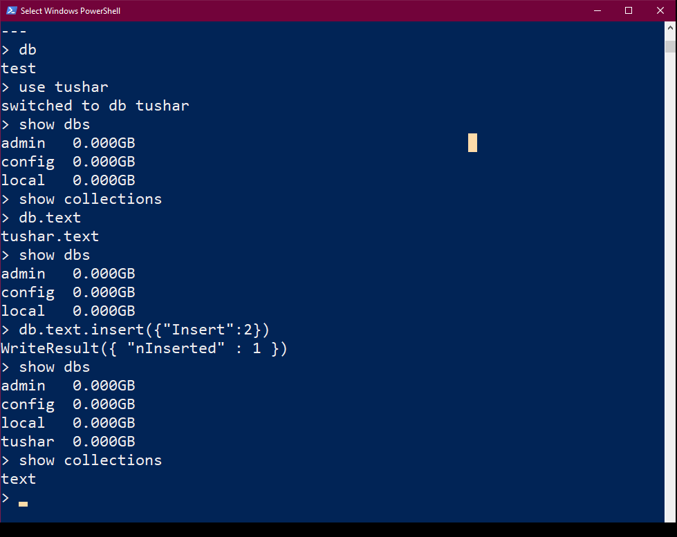

# Introduction to MongoDB
## What is MONGO DB?
<ul>
<li>No SQL Database</li>
<li>Document Oriented</li>

<li>Open-source, cross-platform,document oriented database written in C++</li>
<li>Salient Features:-</li>
<ul>
<li>Develop Faster</li>
<li>Deploy Easier</li>
<li>Scale Bigger</li></ul>
<li>MongoDb development was started in 2007</li>
<li>MongoDb 2.4.9 was the latest and stable version -released on january 10,2014.</li></ul>

## What is a Document Oriented Databse?
<ul>
<li>MongoDB stores data as documents, so it is known as document oriented database.</li>
<li>Data is stores ad BSON(like JSON)</li>
<li>If we come from RDBMS background</li><ul><li>Database == Database</li><li>Tables == Collections</li><li>Rows == Documents</li></ul>
</ul>

## Installing MONGO DB
 
<li><b>mongod</b> is the host process for the database.</li>
<li>mongo is the command-line shell that connects to a specific instance of mongod.</li>
<li>When we run mongo with no parameters it defaults to connecting to the localhost on port 27017.</li>
<li>If we run mongo against an invalid host_machine:port combination then it will fail to connect.</li>

## Basic commands of mongo

  

# Creating databases in MongoDB
we can create and use a database by this command.If the database exists already it will select the database as db or it will create the database.
<pre>use db_name</pre>

# Inserting Data in MongoDB

making collections and inserting data. To insert one object(document) use this command--
<pre>db.items.insertOne({name: "Samsung 30s", price: 22000, rating: 4.5, qty: 233, sold: 98})</pre>
In this items ---- collection 
To insert many objects together we use--
<pre>db.items.insertMany([{name: "Samsung 30s", price: 22000, rating: 4.5, qty: 233, sold: 98}, {name: "Moto 30s", price: 29000, rating: 3.5, qty: 133, sold: 598}, {name: "Realme 80s", price: 129000, rating: 2.5, qty: 633, sold: 98, isBig: true}])</pre>

# Reading data in MongoDB
To view all the database, we will write as--
<pre>show dbs</pre>
select your database--
<pre>use db_name</pre>
To query our database, we can write as 
<pre>db.items.find({rating: 3.5})</pre>
However, we can also use some complex functions like greater than or less than to meet our query as follows-
<pre>db.items.find({rating: {$gt: 3.5}})</pre>

# Deleting Data in MongoDB
to show all the collections we can use--
<pre>show collections</pre>
Deleting items from the Mongo Database
<pre>
db.items.deleteOne({price: 22000})</pre>
deleteOne will delete the matching document entry and will delete the first entry in case of multi document match---
<pre>db.items.deleteMany({price: 129000})</pre>

# Updating data in MongoDB
The updateOne() function is used to update only 1 item 
suppose we want to update the price of “Motto 30s” from 29000 to 2. For doing this, we can write as follows-
<pre>db.items.updateOne({name: "Moto 30s"}, {$set: {price: 2}})</pre>
We have to change the rating of all the three mobiles to 1. To do this, we can write as follows-
<pre>
db.items.updateMany({name: "Moto 30s"}, {$set: {price: 3, rating: 1}})</pre>
The updateMany() function is used to update multiple items.
 

# Mongoose
Mongoose will help you to access MongoDb directly without any hindrance.

# MongoDB Compass

MongoDB Compass analyzes your documents and displays rich structures within your collections through an intuitive GUI. It allows you to quickly visualize and explore your schema to understand the frequency, types and ranges of fields in your data set.

 
It does not let you type the commands. It’s not the matter that we cannot type the commands but a person who is managing a database and wants to add certain data without any coding, he can use MongoDb compass.

For connecting the MongoDb Compass with Mongo database, you need to click on New Collection > Fill in Connection Fields Individually > Connect.

## Connecting mongodb compass to node js
 
We can do this with the help of Mongoose. It is an object data modeling (ODM) library that provides a rigorous modeling environment for your data, enforcing structure as needed while still maintaining the flexibility that makes MongoDB powerful.

We will make a new folder as Mongoosetut. We will open the terminal window and install npm. After installing the package.json file we will write npm install mongoose to install the mongoose.
Now we have to write the following code to connect the database through node-
<pre>
// getting-started.js
const mongoose = require('mongoose');
mongoose.connect('mongodb://localhost/test', {useNewUrlParser: true});</pre>