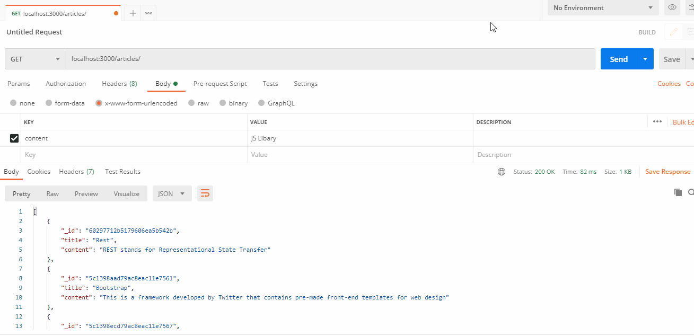

# Building Restful API using Node js, Express js, MongoDB
## What is REST?
REST stands for <b>Representational State Transfer</b> 
The characteristics of a REST system are defined by six design rules:
<ul>
<li>Client-Server: There should be a separation between the server that offers a service, and the client that consumes it.</li><li>
Stateless: Each request from a client must contain all the information required by the server to carry out the request. In other words, the server cannot store information provided by the client in one request and use it in another request.</li><li>
Cacheable: The server must indicate to the client if requests can be cached or not.</li><li>
Layered System: Communication between a client and a server should be standardized in such a way that allows intermediaries to respond to requests instead of the end server, without the client having to do anything different.</li><li>
Uniform Interface: The method of communication between a client and a server must be uniform.</li><li>
Code on demand: Servers can provide executable code or scripts for clients to execute in their context. This constraint is the only one that is optional.
</li>
</ul>

## API funcionalities
<table>
<tr>
<td>HTTP Verbs</td>
<td>/articles</td>
<td>/articles/jquery</td>
</tr>

<tr>
<td>Get</td>
<td>Fetches all the articles</td>
<td>Fetches all the articles on jquery</td>
</tr>

<tr>
<td>POST</td>
<td>Creates one new article</td>
<td>-</td>
</tr>

<tr>
<td>PUT</td>
<td>-</td>
<td>Updates the article on jquery</td>
</tr>

<tr>
<td>PATCH</td>
<td>-</td>
<td>Updates the article on jquery</td>
</tr>

<tr>
<td>DELETE</td>
<td>Deletes all the articles</td>
<td>Deletes the article on jquery</td>
</tr>
</table>

## Preview of API working  
 